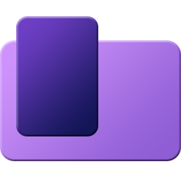

# NCPanel



### REQUIRES [.NET 6.0 RUNTIME](https://download.visualstudio.microsoft.com/download/pr/bf058765-6f71-4971-aee1-15229d8bfb3e/c3366e6b74bec066487cd643f915274d/windowsdesktop-runtime-6.0.1-win-x64.exe).

## But why ?

A remake of my [Commands Panel](https://github.com/Wiltoag/CommandsPanel). This one is easier to use, more flexible and overall better looking (subjective).

NCPanel (New Commands Panel) is a discrete software to put in the corner of a screen and acts as a second shortcut bar, but with a lot more customization. You can add simple commands, internet shortcuts, or anything that can be input in the CLI.

### What changed ?

* The app automatically stick to a corner, no need to precisely move the window.
* Can create custom contextmenu.
* Better plugins support.
* The window goes small when the cursor is far away from the window, not just outside.
* Multiple layouts available.
* Always TopMost, except when the window is in the center of the screen (it also does not stick to a corner).
* Can edit the size of the window.

## Portability

By simply creating a `Data` folder next to the .exe, the app will store its data in this folder instead of `%appdata%/NCPanel`.

## Extensions

The software is fully compatible with plugins (written in C#, .NET 6.0). You will need to create a library project with a dependency to `NCPExtension.dll`. In the .csproj, I recommend tu put :

In the `<PropertyGroup>` :
```xml
<EnableDynamicLoading>true</EnableDynamicLoading>
```

And in the `<ItemGroup>` of the dependecy to `NCPExtension.dll` :
```xml
<Private>false</Private>
<ExcludeAssets>true</ExcludeAssets>
```
Example with the dependency as a project reference :
```xml
<ItemGroup>
  <ProjectReference Include="[path to NCPExtension.csproj]">
    <Private>false</Private>
    <ExcludeAssets>true</ExcludeAssets>
  </ProjectReference>
</ItemGroup>
```

To install the plugin, create a folder with the same name as your dll, and put every dll required (**BUT NOT `NCPExtension.dll`**) in this folder. Then move this folder to the `Data/plugins` folder of the app.

A small example is available on the git, which use `Newtonsoft.Json` as a dependency.

## Screenshots


